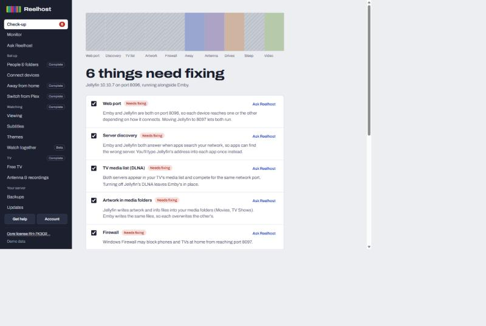

# Reelhost

**Jellyfin, set up right.** Reelhost is an app for Windows and Mac, with a Docker edition for NAS boxes and Linux servers, that sets up and fixes your [Jellyfin](https://jellyfin.org) media server in plain words. Every change shows exactly what it will do first, makes a backup, and can be undone in one click.

**Website:** [reelhost.app](https://reelhost.app) · **Help:** [reelhost.app/help](https://reelhost.app/help) · **What's new:** [reelhost.app/changelog](https://reelhost.app/changelog)

## Download

| | |
|---|---|
| **Windows** 10 or 11, 64-bit | [Download for Windows](https://api.reelhost.app/download) |
| **Mac** macOS 12 or later, Apple silicon or Intel | [Download for Mac](https://api.reelhost.app/download?platform=mac) |
| **Docker** Synology, Unraid, TrueNAS, Linux | [Set up the Docker edition](https://reelhost.app/#download) |

Every version, with its notes, is also on this repository's [Releases](https://github.com/Reelhostapp/reelhost/releases) page. Reelhost updates itself, so you only download it once.

> The Windows installer is signed by **Wizzered Inc.** and the Mac app is signed and notarized by Apple. If Windows still shows a notice the first time, check it names Wizzered Inc., then choose **More info** and **Run anyway**.

## What it does

- **A free check-up** of your Jellyfin server: ten checks, each explained in plain words. It changes nothing.
- **Fixes with a preview, a backup and one-click restore**: the web port, server discovery, the TV media list, artwork, the firewall, sleep settings, video speed on your graphics card, network drives.
- **Set up Jellyfin for you**, from nothing to watching.
- **Watch away from home** with your own web address (yourname.watchhome.app) or Tailscale.
- **Switch from Plex**, **Watch together** (beta), people, kids and folders, Free TV, antenna recordings with commercial skipping, subtitles and AI subtitles (beta), Monitor with email alerts, sync jobs between drives.

The check-up is free. Plans: Core, Complete (lifetime licenses) and Yearly. See [pricing](https://reelhost.app/#pricing).

## Found a bug?

[Open an issue](https://github.com/Reelhostapp/reelhost/issues/new/choose), or use **Get help** in the app: it fills in a short diagnostics report you can read before sending. For anything about your purchase or license, write to [support@reelhost.app](mailto:support@reelhost.app).

---

Reelhost is made by Wizzered Inc. It is proprietary software: this repository holds downloads, release notes and bug reports, not source code. Reelhost isn't affiliated with the Jellyfin project. [Terms](https://reelhost.app/terms) · [Privacy](https://reelhost.app/privacy)
